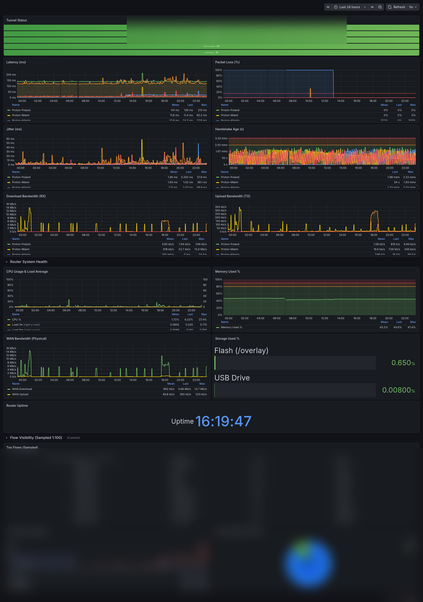

# GL.iNet WireGuard Monitor



Monitor multiple WireGuard VPN tunnels on a GL.iNet router. Every minute, the router checks each tunnel's handshake freshness, measures latency/jitter/packet loss, and reports to two services:

- **[healthchecks.io](https://healthchecks.io)** — sends you an alert (email, Slack, PagerDuty, etc.) when a tunnel goes down
- **[Grafana Cloud](https://grafana.com)** — stores metrics and displays a live dashboard

No collector, agent, or cloud VM needed — just scripts that run directly on the router via cron.

**Windows users:** use `manage.ps1` — an interactive PowerShell menu for all operations (deploy, backup, maintenance, diagnostics). No bash required.

---

## What It Monitors

**Per tunnel (every 1 minute):**
- Tunnel up/down (WireGuard handshake age)
- Latency, jitter, packet loss (ping to WireGuard endpoint)
- Bytes in/out and throughput (bytes/sec)

**Router system (every 1 minute):**
- CPU usage, memory, load averages, uptime
- WAN bandwidth (bytes/sec)
- Active connections (conntrack table)
- Flash and USB storage usage

**Network flows (every 5 minutes):**
- Top 25 flows by traffic volume
- Per-LAN-client traffic totals
- Per-protocol traffic totals

---

## Architecture

```
GL.iNet router (OpenWrt)
  └── cron (every 1 min)  → check-vpn.sh
  └── cron (every 5 min)  → netflow-monitor.sh
         │                        │
         ▼                        ▼
  healthchecks.io          Grafana Cloud
  (alerts/notifications)   (metrics storage + dashboard)
```

All credentials live in `/etc/vpn-monitor/config` on the router (permissions 600, not in this repo).

---

## Prerequisites

- GL.iNet router running OpenWrt (tested on GL-BE3600 series)
  - Must have: `curl`, `wg`, `awk`, `base64`, `cron`
  - GL.iNet firmware includes all of these
- SSH access to the router (`root` user)
- [Grafana Cloud account](https://grafana.com) — free tier is sufficient
- [healthchecks.io account](https://healthchecks.io) — free tier is sufficient
- Local machine with `bash` and `ssh` (Git Bash works on Windows)

---

## Windows Quick Start

If you're on Windows, use the PowerShell management menu instead of running bash scripts manually:

```powershell
# In PowerShell (run from the repo folder):
.\manage.ps1
```

The menu handles everything: first-time deploy, config updates, maintenance pausing, backups, and diagnostics. It prompts for your router IP and SSH key path on first run, then saves them for future sessions.

> Requires OpenSSH (built into Windows 10/11 — no extra install needed).

---

## Setup

### Step 1 — SSH Key

Generate a dedicated key and copy it to your router:

```bash
ssh-keygen -t ed25519 -f ~/.ssh/glinet_key -N ""
ssh-copy-id -i ~/.ssh/glinet_key.pub root@<YOUR_ROUTER_IP>
```

If `ssh-copy-id` isn't available (Windows), manually append the public key:

```bash
cat ~/.ssh/glinet_key.pub | ssh root@<YOUR_ROUTER_IP> "cat >> /root/.ssh/authorized_keys"
```

Test it: `ssh -i ~/.ssh/glinet_key root@<YOUR_ROUTER_IP>`

---

### Step 2 — Grafana Cloud

1. Sign up at [grafana.com](https://grafana.com) (no credit card required)
2. In the portal: **My Account** → your stack → **Details**
   - Copy the numeric **Instance ID** → this is your `GRAFANA_METRICS_ID`
3. Create a token: **My Account** → **Access Policies** → **New access policy**
   - Scope: `metrics:write`
   - Copy the token → this is your `GRAFANA_TOKEN`
4. Find your push URL under **Prometheus** → **Details** → **Remote Write Endpoint**
   - Replace `prometheus` in the hostname with `influx` and change the path:
   - Example: `https://influx-prod-26-prod-ap-south-0.grafana.net/api/v1/push/influx/write`
   - This is your `GRAFANA_URL`

---

### Step 3 — healthchecks.io

1. Sign up at [healthchecks.io](https://healthchecks.io)
2. Create one check per WireGuard tunnel:
   - **Period:** 2 minutes, **Grace:** 2 minutes
   - Name it something descriptive (e.g. the VPN server location)
   - Copy the ping UUID from each check URL
3. Get your API key: **Settings** → **API Access** → copy the **read-write** key
   - This is your `HCHK_API_KEY` (needed only for the maintenance pause/resume feature)

---

### Step 4 — Configure

Copy `config.example` to `config` and fill in your values:

```bash
cp config.example config
```

Edit `config`:

```sh
# healthchecks.io
HCHK_API_KEY=your-read-write-api-key

# One line per WireGuard tunnel — interface name = healthchecks UUID
wgclient1=xxxxxxxx-xxxx-xxxx-xxxx-xxxxxxxxxxxx
wgclient2=xxxxxxxx-xxxx-xxxx-xxxx-xxxxxxxxxxxx
# ... add or remove lines as needed

# Optional display labels for the Grafana dashboard
wgclient1_name=VPN-Location-1
wgclient2_name=VPN-Location-2

# Grafana Cloud
WAN_IFACE=eth1                    # check: ls /sys/class/net/ on router
GRAFANA_METRICS_ID=1234567
GRAFANA_TOKEN=glc_xxxxxxxxxxxx
GRAFANA_URL=https://influx-prod-XX-prod-XX.grafana.net/api/v1/push/influx/write
ROUTER_NAME=my-router             # label shown on dashboard (no spaces)
```

> **Finding your WAN interface:** SSH to the router and run `ls /sys/class/net/` — it's usually `eth1` or `wan`.

> **Tunnel interface names:** On GL.iNet routers, WireGuard client tunnels are named `wgclient1`, `wgclient2`, etc. by default. Check yours with `wg show` on the router.

---

### Step 5 — Deploy

From this repo directory, run:

```bash
bash deploy.sh
```

This will:
- Create `/etc/vpn-monitor/` on the router
- Upload `config`, `check-vpn.sh`, `netflow-monitor.sh`, `maintenance.sh`
- Register cron jobs (check-vpn every minute, netflow every 5 minutes)
- Install a boot-time script to auto-resume monitoring after reboots
- Register maintenance window crons (Mon & Thu 2:55 AM pause, 3:15 AM resume)
- Run each script once to verify

**Expected output:** healthchecks.io checks turn green within 2 minutes. Grafana starts receiving data immediately.

---

### Step 6 — Grafana Dashboard

1. In Grafana Cloud, go to **Dashboards** → **Import**
2. Upload `grafana-dashboard.json`
3. Select your Prometheus/Grafana Cloud datasource when prompted

The dashboard shows tunnel status, latency, bandwidth, and system health panels with threshold-based coloring. See `dashboard.png` for an example.

---

## Customization

### Adding or removing tunnels

Edit `config` on your local machine, then redeploy just the config:

```bash
bash deploy-config.sh
```

This uploads the updated config and runs a live test — no need to re-run the full `deploy.sh`.

### Changing maintenance window schedule

Edit the cron expressions in `deploy.sh` before running it, or edit the crontab on the router directly:

```bash
ssh -i ~/.ssh/<YOUR_SSH_KEY> root@<YOUR_ROUTER_IP> crontab -e
```

### Fewer or more tunnels

The config supports any number of `wgclientN` entries. `maintenance.sh` currently loops through `wgclient1`–`wgclient5` — edit the loop if you have more.

---

## Maintenance Windows

During scheduled router reboots or VPN reconnections, `maintenance.sh` pauses healthchecks.io checks to suppress false alerts.

Manual use:

```bash
# On the router:
/bin/sh /etc/vpn-monitor/maintenance.sh start   # pause all checks
/bin/sh /etc/vpn-monitor/maintenance.sh stop    # resume all checks
```

The `deploy.sh` script also installs:
- A cron job that auto-pauses at 2:55 AM on Mon/Thu
- A cron job that auto-resumes at 3:15 AM on Mon/Thu
- A boot-time init script that resumes checks 30 seconds after any reboot

---

## Router Backups

`backup.sh` creates a full `sysupgrade`-compatible router backup:

```bash
bash backup.sh
```

Saves a copy to:
- USB drive on the router (`/tmp/mountd/disk1_part1/router-backups/`)
- Local `backups/` folder (excluded from git via `.gitignore`)

Keeps the last 14 backups in each location. Requires a USB drive plugged into the router.

Also ensures `/etc/vpn-monitor/` is listed in `/etc/sysupgrade.conf` so your monitoring config survives firmware upgrades.

---

## Troubleshooting

### Tunnels show as down immediately after deploy

Check that the interface names in `config` match what the router actually uses:

```bash
ssh -i ~/.ssh/<YOUR_SSH_KEY> root@<YOUR_ROUTER_IP> "wg show"
```

### No data appearing in Grafana

Test the push directly on the router:

```bash
# Copy debug-push.sh to the router, then run it:
scp -i ~/.ssh/<YOUR_SSH_KEY> debug-push.sh root@<YOUR_ROUTER_IP>:/tmp/
ssh -i ~/.ssh/<YOUR_SSH_KEY> root@<YOUR_ROUTER_IP> "sh /tmp/debug-push.sh"
```

Look for HTTP 204 in the curl output — that's success. Common issues:
- `GRAFANA_URL` uses the Prometheus endpoint instead of the Influx endpoint
- Token scope is missing `metrics:write`
- `base64` not available on the router (very rare on GL.iNet)

### Run the check script manually

```bash
ssh -i ~/.ssh/<YOUR_SSH_KEY> root@<YOUR_ROUTER_IP> "/bin/sh /etc/vpn-monitor/check-vpn.sh"
```

### Check cron is running

```bash
ssh -i ~/.ssh/<YOUR_SSH_KEY> root@<YOUR_ROUTER_IP> "crontab -l"
```

### Full diagnostics

```bash
bash diagnose.sh
```

---

## File Reference

| File | Runs on | Purpose |
|------|---------|---------|
| `check-vpn.sh` | Router (cron, 1 min) | Tunnel status + system metrics |
| `netflow-monitor.sh` | Router (cron, 5 min) | Network flow metrics |
| `maintenance.sh` | Router | Pause/resume healthchecks alerts |
| `deploy.sh` | Local | Initial deployment to router |
| `deploy-config.sh` | Local | Update config on router |
| `backup.sh` | Local | Router config backup |
| `diagnose.sh` | Local | SSH into router for diagnostics |
| `debug-push.sh` | Router (manual) | Test Grafana Cloud connectivity |
| `config.example` | — | Template — copy to `config` and fill in |
| `grafana-dashboard.json` | Grafana Cloud | Import for pre-built dashboard |
| `manage.ps1` | Local (Windows) | Interactive PowerShell menu for all operations |

---

## Security Notes

- `config` is excluded from git (see `.gitignore`) — never commit it
- The config is uploaded to the router with `chmod 600` (root-only readable)
- SSH key authentication is used; password auth is not required
- Router backups in `backups/` are also excluded from git — they may contain WireGuard private keys
